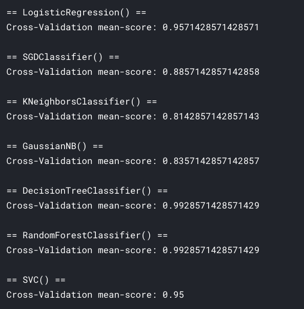
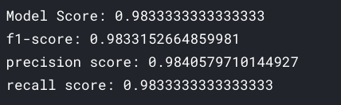
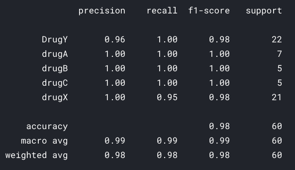
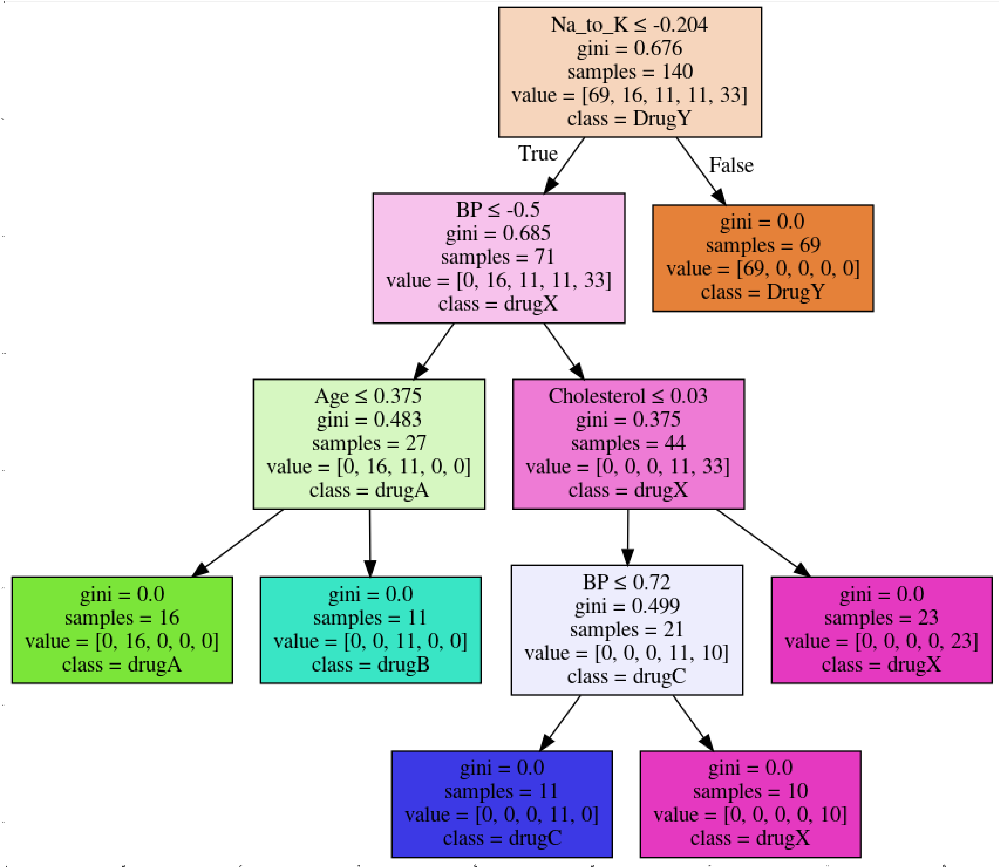

# Drugs Classifier using Decision Tree

Here [Drug Classification](https://www.kaggle.com/prathamtripathi/drug-classification) dataset by [Pratham Tripathi](https://www.kaggle.com/prathamtripathi) is used to create a classifier that classifies `drugs` on the basis of it `properites` using `Decision Tree`.

## Table of contents

- [Getting started](#getting-started)
- [Modelling stage info](#modelling-stage-info)
- [License](#license)

## Getting started

The [notebook](https://www.kaggle.com/akashsdas/drugs-classifier-using-decision-tree) is available on Kaggle to work in the same environment where this notebook was created i.e. use the same version packages used, etc...

## Modelling stage info

**Different models cross validation score**

**Trained model scores**

**Classification report**

**Decision Tree image**

## License

[APACHE LICENSE, VERSION 2.0](./LICENSE)
